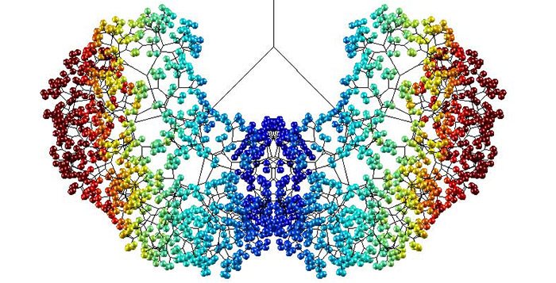
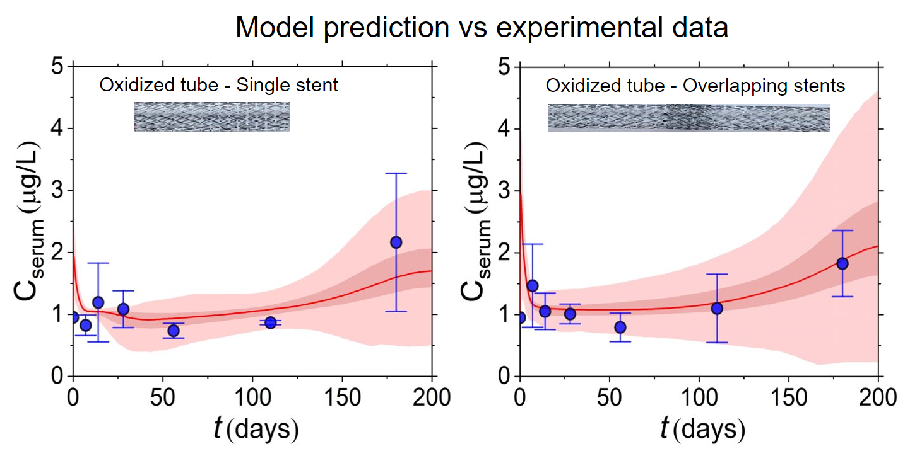

[Home](index.md) | [Readme](README.md)

# <i>Detailed Portfolio</i>

---

<iframe width="560" height="315" src="https://www.youtube.com/embed/_HGQZlK08gQ?autoplay=1" frameborder="0" allow="autoplay; encrypted-media" allowfullscreen></iframe>
  
---

## About Me
- [ BS in Mechanical Engineering and Materials Science ](#bs) 
- [ MEng in Natural Gas Engineering ](#meng) 
- [ MBA in Energy and Environmental Management & Economics ](#master) 
- [ Publications ](#pubs) 
- [ Conference Presentations ](#conf) 
- [ Further Interests ](#further) 
- [ Contact ](#contact) 

---

## Research Experience
- [ Technologies for the Energy Transition - FEEM ](#feem) 
- [ Geomechanics Research for Energy and Environment - UCY ](#gree) 
- [ Biomechanics and Living Systems Analysis - CUT ](#biolisys) 
- [ Material Thermodynamics Laboratory - CUT ](#thermodyn) 
- [ Device Technology & Chemical Physics Lab - CUT ](#devicetech) 
- [ Research Unit for Nanostructured Materials Science - CUT ](#nano) 

---

## Teaching Experience
- [ Instructor - Master on Natural Gas in Energy Transition ](#instr) 
- [ University Tutor - Center of Student Development ](#tutor) 
- [ Mathematics Tutor for High School Students ](#math) 

---

## Biolysis Lab - CUT
[Link to the website](http://)
 
"NITOXILICO" 
 
Toxicokinetic Modelling – Model Parameterization and Optimization of ordinary differential 
equations with deterministic and stochastic techniques, using iterative methods and global 
optimization algorithms. 
 
Contributor to USPTO provisional patent –Application Number: US 63/193,947
  

 
---

## Biomechanics and Living Systems Analysis - Cyprus University of Technology (CUT)
 
<b><u>["NITOXILICO" project:](http://biolisys.cut.ac.cy/research/projects/active-projects/nitoxilico/)</u></b>
(POST-DOC/0916/0237), funded by the Cyprus Research and Innovation Foundation. 
<b><u>Granted:</u></b> €160,000
<b><u>Achievement:</u></b> Contributor to patent [(PCT/EP2022/064468)](https://ktisis.cut.ac.cy/handle/20.500.14279/29213)
<b><u>Parameterization & Optimization of Predictive Physiological Based Toxicokinetic (PBTK) Models:</u></b> We pioneered a predictive compartmental PBTK model to assess Nickel leaching from cardiovascular devices. We conducted in-house animal experiments, integrating the data into a time-variant system of ODEs. The system was framed within a multi-objective optimization problem, aiming to balance various physiological and device-specific parameters across the compartments (organs). Inherent to such models, data limitations and measurement uncertainties introduced a high degree of non-smoothness to the model’s objective function. Τo address this, we employed global optimization algorithms and stochastic analysis. This work resulted in three publications (see [1](#pub1), (3) & (5)). We are now expanding our research to simulate the interactions in the peri-implant environment using PDEs. The current model offers valuable insights to stent manufacturers about device leachability, aiding in risk assessment and minimizing the need for additional animal testing. We are in the process of developing a platform to offer this service, with plans for monetization.
<b><u></u></b>
 
  

 
---

## Biomechanics and Living Systems Analysis - Cyprus University of Technology (CUT)
 

- [<b><u>"NITOXILICO" project:</u></b>](http://biolisys.cut.ac.cy/research/projects/active-projects/nitoxilico/)
(POST-DOC/0916/0237), funded by the Cyprus Research and Innovation Foundation.
 
<b><u>Granted:</u></b> €160,000
 
<b><u>Achievement:</u></b> Contributor to patent [(PCT/EP2022/064468)](https://ktisis.cut.ac.cy/handle/20.500.14279/29213)
 
- <b><u>Parameterization & Optimization of Predictive Physiological Based Toxicokinetic (PBTK) Models:</u></b> We pioneered a predictive compartmental PBTK model to assess Nickel leaching from cardiovascular devices. We conducted in-house animal experiments, integrating the data into a time-variant system of ODEs. The system was framed within a multi-objective optimization problem, aiming to balance various physiological and device-specific parameters across the compartments (organs). Inherent to such models, data limitations and measurement uncertainties introduced a high degree of non-smoothness to the model’s objective function. Τo address this, we employed global optimization algorithms and stochastic analysis. This work resulted in three publications (see [1](#pub1), (3) & (5)). We are now expanding our research to simulate the interactions in the peri-implant environment using PDEs. The current model offers valuable insights to stent manufacturers about device leachability, aiding in risk assessment and minimizing the need for additional animal testing. We are in the process of developing a platform to offer this service, with plans for monetization.

<b><u></u></b>
 
Toxicokinetic Modelling – Model Parameterization and Optimization of ordinary differential 
equations with deterministic and stochastic techniques, using iterative methods and global 
optimization algorithms. 
 
Contributor to USPTO provisional patent –Application Number: US 63/193,947
  

 
---

## Material Thermodynamics - CUT
[Link to the website](http://)
 
 
Thermodynamic control of reactive spontaneous systems 
 
In-situ high temperature X-ray diffraction (XRD)
  

 
---

## Device Technology and Chemical Physics - CUT
[Link to the website](http://)
 
 
UV-VIS absorption of organic nanomaterials (OLEDs, OPVs). 
 
Deposition techniques: Spin Coating, Doctor Blade, Inkjet Printing. 
 
Characterisation techniques: Optical Microscope.
  

 
---

## Nanostructured Material Science - CUT
[Link to the website](http://)
 
 
Fabrication & Characterization of Supercapacitors. 
 
X-ray powder diffraction (XRD): RIR - Quantitative phase analysis. 
 
Scanning Electron Microscopy (SEM).
  

 
---

## Tutor of Mathematics
[Link to the website](http://)
 
 
Preparing students for the Pancyprian examination of mathematics.
  

 
---

## BSc/BEng Mechanical Engineering
[Link to the website](http://)
 
Department of Mechanical Engineering and Materials Science and Engineering / Faculty of Engineering 
and Technology / Cyprus University of Technology 
 
<b>GPA:</b> 8.975/10 – 1st Hons. 
  

 
---

## MSc Natural Gas in Energy Transition
[Link to the website](http://)
 
Department of Civil and Environmental Engineering / Faculty of Engineering / University of Cyprus 
 
<b>GPA:</b> 9.57/10
  

 
---

## Master in Energy, Environmental Management & Economics
[Link to the website](http://)
 
Department of Economics and Management & ENI Scuola Mattei / University of Pavia 
 
Pending details
  

 
---

## Publications
[Link to the website](http://)
 
Coding
  

 
---

## Further Interests
[Link to the website](http://)
 
Coding
  

 
---

## Further Interests
[Link to the website](http://)
 
Coding
  

 
---

## Contact

Get in touch with me at matheos.giakoumis97@hotmail.com


