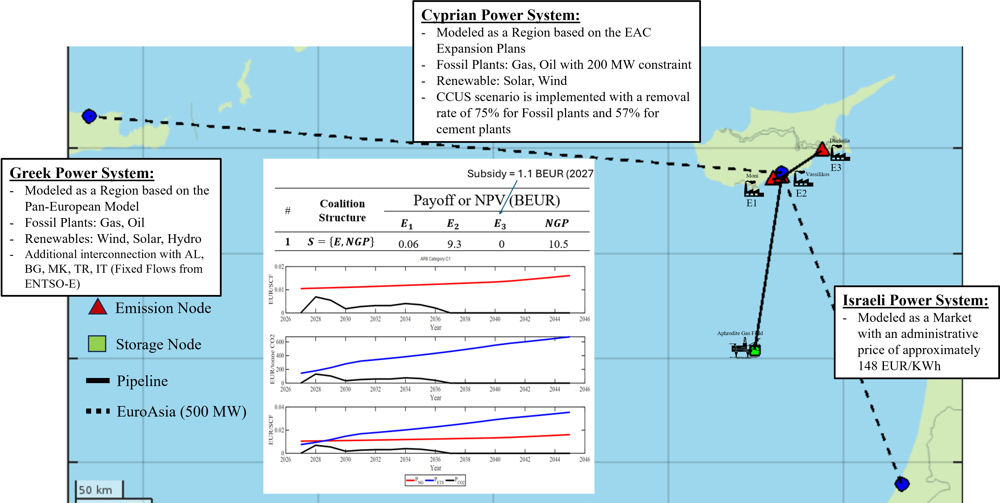

  
    
       
    <h1>Detailed Portfolio</h1>

  

  

<iframe width="460" height="315" src="https://www.youtube.com/embed/_HGQZlK08gQ?autoplay=1&mute=1" frameborder="0"   allow="autoplay; encrypted-media" allowfullscreen playsinline></iframe>

     
  

  <h2>UPDATES OF THE PROFILE FOR THE GRADUATE ADMISSION COMMITTEE</h2>
    <ul>

<li> <strong><u>January 1st, 2024:</u></strong> Happy New Year! Matheos' New Year Resolution is Hydrogen.
</li>    

<li> <strong><u>December 29th, 2023:</u></strong> The publication titled "Mathematical Tools for Advances in Field Development Plans" (<a href="#pubs">publication 4</a>) was submitted at the SPE Journal.
</li>

<li> <strong><u>December 25th, 2023:</u></strong> Happy Holidays!
</li>
      
<li> <strong><u>December 18th, 2023:</u></strong> The publication titled "A Screening Tool for Carbon Dioxide Injection in Gas Reservoirs with Water Influx Based on the Materials Balance Approach" (<a href="#pubs">publication 2</a>) was accepted for publication at the Geomechanics for Energy and The Environment.
</li>
      
<li> <strong><u>December 12th, 2023:</u></strong> Minor revisions have been received for the publication (<a href="#pubs">publication 3</a>) titled "A Predictive Toxicokinetic Model for Nickel Leaching for Vascular Stents". It is worth noting that the title has been updated in the revised version from the one mentioned in my resume (Cardiovascular Stents to Vascular Stents).
</li>

<li> <strong><u>December 11th, 2023:</u></strong> I have been invited to participate in the <a href="https://podcasters.spotify.com/pod/show/science-talks-ucy" target="_blank"> Science Talks-Podcast</a> at the University of Cyprus. The recording will take place in early April.
</li>

<li> <strong><u>December 10th, 2023:</u></strong> A Long Abstract has been submitted for presentation at the Twelfth IAERE Annual Conference in Pescara, Italy. Further information can be found <a href="#conf">here</a>.
</li>

<li> <strong><u>December 6th, 2023:</u></strong> I was invited to give two lectures, one on the 6th and the other on the 13th of December, for the Energy Economics course at the Master's program in Environmental and Food Economics at the University of Milan. Further information can be found <a href="#instrunimi">here</a>.
</li>

<li> <strong><u>December 5th, 2023:</u></strong> I have been assigned as the first author of a publication (<a href="#pubs">publication 4</a>) that is currently being prepared, titled "Mathematical Tools for Advances in Field Development Plans" (please note that the name has been changed from the one mentioned in my resume, from Advances in the Field Development Plans (FDPs) to Mathematical Tools for Advancements in Field Development Plans).
</li>

<li> <strong><u>December 5th, 2023:</u></strong> Our work on Advancements in Field Development Plans was successfully presented at the Fourth EAGE Eastern Mediterranean Workshop.
</li>

<li> <strong><u>December 4th, 2023:</u></strong> I have been invited by the Cyprus University of Technology alumni to participate in their "CUTalumni Success Stories" initiative.
</li>
    </ul>
  
  <h2>Academics</h2>
    <ul>
      <li><a href="#mba">MBA in Energy and Environmental Management & Economics</a></li>
      <li><a href="#meng">MEng in Natural Gas Engineering</a></li>
      <li><a href="#bs">BS in Mechanical Engineering and Materials Science</a></li>
      <li><a href="#pubs">Publications (peer-reviewed)</a></li>
      <li><a href="#conf">Conference Presentations</a></li>
    </ul>

  <h2>Research Experience</h2>
    <ul>
      <li><a href="#feem">Technologies for the Energy Transition - FEEM</a></li>
      <li><a href="#gree">Geomechanics Research for Energy and Environment - UCY</a></li>
      <li><a href="#biolisys">Biomechanics and Living Systems Analysis - CUT</a></li>
      <li><a href="#thermodyn">Material Thermodynamics Laboratory - CUT</a></li>
      <li><a href="#devicetech">Device Technology & Chemical Physics Lab - CUT</a></li>
      <li><a href="#nano">Research Unit for Nanostructured Materials Science - CUT</a></li>
    </ul>
  
  <h2>Teaching Experience</h2>
    <ul>
      <li><a href="#instrucy">Instructor - Master on Natural Gas in Energy Transition</a></li>
      <li><a href="#instrunimi">Visiting Instructor - Master on Environmental and Food Economics</a></li>
      <li><a href="#tutor">University Tutor - Center of Student Development</a></li>
      <li><a href="#math">Mathematics Tutor for High School Students</a></li>
    </ul>

  <h2>Other</h2>
    <ul>
      <li><a href="#further">Further Interests</a></li>
      <li><a href="#contact">Contact</a></li>
    </ul>

  

  

  
  

     
  <h1>EDUCATION</h1>
 
  
     
  <h2>MBA in Energy and Environmental Management and Economics - MEDEA (92.71/100 - 1st Level 1)</h2>
  <a href="https://www.eni.com/en-IT/careers/medea-masters.html" target="_blank">Link to Website</a>

  

  <I><strong>Department of Economics and Management & ENI Scuola Mattei / University of Pavia</strong></I>
  <ul>
      <li><strong><u>Honors and Awards:</u></strong> </li>
      <ul> 
          <li> Honorary distinction for the highest grade among the program (Managing Technical Assets).</li>
          <li> Luciano Novelli Award: Awarded for the best dissertation in the program.</li>
      </ul>    
      <li><strong><u>Notable Courses:</u></strong> Quantitative Methods for Management (97/100), Economics (97/100), Energy Transition and Climate Change Economics (94/100), Energy Economics and Policy (95/100), Corporate Finance (100/100), Strategic Management (99/100), Renewables and Economics of Electricity (96/100), Field Development Strategy (100/100),
      </li>
      <li><strong><u>Scolarship:</u></strong> The program was fully funded (Tuition, Stipend & Living Expenses) by <a href="https://www.eni.com/en-IT/home.html" target="_blank">ENI S.p.A</a>  <strong>(Awarded: €39,000)</strong>. 
      </li>
      <li><strong><u>Dissertation Topic:</u></strong> “Smart Contracts in Well Operations” (Novelli Award)  
      In a group project supervised by the Well Operations department at ENI S.p.A., we explored optimizing the operation working capital in offshore drilling via Smart Contracts. After reviewing blockchain technology and developing smart contracts on Ethereum, we modeled their economic impact. Our findings were encapsulated in a thesis and highlighted by a live blockchain lottery demonstration, underscoring the tech's practicality in the Oil and Gas industry. Our project was guided by industry professionals including <a href="https://it.linkedin.com/in/carla-sanasi-078211245" target="_blank"> Carla Sanasi</a>, <a href="" target="_blank"> Marco Amicosante</a>, <a href="https://it.linkedin.com/in/uperna" target="_blank"> Umberto Pena</a>. 
   
  Group Members: <a href="https://it.linkedin.com/in/lorenza-bifano-a56551199" target="_blank"> Lorenza Bifano</a>, <a   href="https://it.linkedin.com/in/giacomo-pernazza-b73a4a11b" target="_blank"> Giacomo Pernazza</a>, <a href="https://ly.linkedin.com/in/tarek-zaghonni-62b93b1b4" target="_blank"> Tarek Zaghonni</a>  
<a href="https://sepolia.etherscan.io/tx/0xd89b6647e13959242dbdf696936509ca4c366e46341131e0fbbde87aa963d07f" target="_blank"> Winner:</a> <a href="https://uk.linkedin.com/in/spyridonas-thakis-christodoulou-310089182" target="_blank"> Thagy Christodoulou</a>
      </li>
      <li>2022 - 2023 
      </li>  
  </ul>

  

  

  
     
  <h2>MEng Natural Gas Engineering (9.57/10 - Highest Honors)</h2>
  <a href="https://websites.ucy.ac.cy/petcy/en/" target="_blank">Link to Website</a>

  

  <I><strong>Department of Civil and Environmental Engineering / Faculty of Engineering / University of Cyprus</strong></I>
  <ul>
      <li><strong><u>Dissertation Topic:</u></strong> “The Frigg Field Development Plan (FDP) revisited”. For more information click <a href="#gree">here</a>.
      </li>
      <li><strong><u>Notable Courses:</u></strong> Petroleum Geomechanics (10/10), Reservoir Engineering (10/10), Formation Evaluation (10/10), Well and Subsea Completion and Production (10/10).
      </li>
      <li><strong><u>Honors:</u></strong> Honorary distinction for the highest grade among the program.
      </li>
      <li><strong><u>Scolarship:</u></strong> The program was fully funded (Tuition & Stipend) by the <a href="https://hydrocarbons.gov.cy/en/" target="_blank">Hydrocarbons Service from Ministry of Energy Commerce and Industry of Cyprus</a>  <strong>(Awarded: €14,500)</strong>. 
      </li>
      <li>2021 - 2023 
      </li>  
  </ul>

  

  
  
  
     
  <h2>BS Mechanical Engineering and Materials Science (8.975/10 - Highest Honors)</h2>
  <a href="https://www.cut.ac.cy/faculties/fet/mem/study-guide/Bachelor/?languageId=1" target="_blank">Link to Website</a>

  

<I><strong>Department of Mechanical Engineering and Materials Science and Engineering / Faculty of Engineering and Technology / Cyprus University of Technology</strong></I>
  <ul>
      <li><strong><u>Dissertation Topic:</u></strong> “Reactive gas systems with simulated and non-limiting controlled equilibrium”. For more information click <a href="#thermodyn">here</a>.
      </li>
      <li><strong><u>Notable Courses:</u></strong> Programming Principles (10/10), Thermodynamics of Engineering Materials (10/10), Mathematics (Average) (9.625/10), Fluid Mechanics (9.5/10), Stress Analysis (9.5/10), Materials Laboratory (9.0/10), Dynamics of Mechanical Systems (9.0/10), Automatic Control Systems (9.5/10), Quantum Mechanics and Statistical Thermodynamics (9.5/10), Solid State Physics (9.0/10), Building Energy Performance (9.0/10).
      </li>
      <li><strong><u>Honors and Awards:</u></strong> Honorary distinction for the highest grade among the department’s undergraduates for all the academic years enrolled (2017 – 2021) and for the best dissertation in the program. Awarded by ExxonMobil Cyprus & Cyprus Ministry of Education and Culture  <strong>(Awarded: €4,500)</strong>. 
      </li>
      <li><strong><u>Scolarship:</u></strong> The program was fully funded (Stipend) by the <a href="http://www.cyscholarships.gov.cy/mof/ikyk/ikyk.nsf/index_gr/index_gr?OpenDocument" target="_blank">Cyprus State Scholarship Foundation</a>  <strong>(Awarded: €12,000)</strong>. 
      </li>
      <li>2017 - 2021 
      </li>  
  </ul>

  

  
     

 

  
  

       
  <h1>PUBLICATIONS (PEER-REVIEWED)</h1>
   

  

  <ol>
      <li><strong> Giakoumi, M.</strong>, Stephanou, PS., Kapnisis, KK., Anayiotos, A. “On the Development of Physiologically Based Toxicokinetic Models (PBTK) for Cardiovascular Implants”. <a href="https://www.sciencedirect.com/journal/regulatory-toxicology-and-pharmacology" target="_blank"> Regulatory Toxicology and Pharmacology</a>. 2023 Sep 1;144:105489. <a href="https://www.sciencedirect.com/science/article/abs/pii/S0273230023001575" target="_blank"> DOI: 10.1016/j.yrtph.2023.105489</a>. PMID: 37659713.
       
      <strong>Status</strong>: Published
      </li>
       
      <li><strong> Giakoumi, M.</strong>, Konstantinou, C., Ehlig-Economides, C., Papanastasiou, P. “A Screening Tool for Carbon Dioxide Injection in Gas Reservoirs with Water Influx Based on the Material Balance Approach”. <a href="https://www.sciencedirect.com/journal/geomechanics-for-energy-and-the-environment" target="_blank"> Geomechanics for Energy and The Environment</a>. 2023 Dec 23, ISSN 2352-3808, <a href="https://www.sciencedirect.com/science/article/abs/pii/S2352380823001016" target="_blank"> DOI: 10.1016/j.gete.2023.100532</a>.
       
      <strong>Status</strong>: Published
      </li>
       
      <li><strong> Giakoumi, M.</strong>, Stephanou, PS., Kokkinidou, D., Papastefanou, C., Kapnisis, KK., Anayiotos, A. “A Predictive Toxicokinetic Model for Nickel Leaching from Vascular Stents”. <a href="https://pubs.acs.org/journal/abseba" target="_blank"> ACS Biomaterials Science & Engineering</a>.
       
      <strong>Status</strong>: Under Minor Revisions
      </li>
       
      <li> <strong>Giakoumi, M.</strong>, Konstantinou, C., Papadimitriou, N., Panagiotou, F. C., Tsangarides, A., Iosif, G., Stasis, N., Finiris, S., Georgiou, V., Papanastasiou, P. “Mathematical Tools for Advances in the Field Development Plans (FDPs)”. <a href="https://onepetro.org/sj" target="_blank"> SPE Journal</a>.
       
      <strong>Status</strong>: Submitted
      </li>
       
      <li><strong> Giakoumi, M.</strong>, Stephanou, PS., Kapnisis, KK., Anayiotos, A. “Analytical solutions to PBKT (or simply biokinetic) models using the matrix exponential”.
       
      <strong>Status</strong>: In Preparation
      </li>
       
  </ol>

  

   

  

  
  
     
  <h1>CONFERENCE PRESENTATIONS</h1>
     

  

  <ol>
      <li> <strong>Giakoumi, M.</strong>, Zanini, S., Agathokleous, R., Pontoni, F. (2023). “Beyond Traditional Analysis: A Stochastic Framework for Evaluating Energy Retrofit Investments”. Submitted (Long Abstract) for presentation at the <a href="https://www.iaere.org/conferences/2024/index.html" target="_blank">Twelfth IAERE Annual Conference</a> , Pescara, Italy, 22 – 23 February 2024.
      </li>  
          
    <li> Konstantinou, C., Papadimitriou, N., <strong>Giakoumi, M.</strong>, Tsangarides, A., Iosif, G., Stasis, N., Finiris, S., Georgiou, V., Panagiotou, F. C., Papanastasiou, P. (2023). “Advancements in Field Development Plans: Applicability of the Frigg field findings in the Eastern Mediterranean analogues”.<a href="https://www.earthdoc.org/content/proceedings/east-med-2023" target="_blank"> Fourth EAGE Eastern Mediterranean Workshop</a>, Athens, Greece, 4 – 6 December 2023. <a href="https://doi.org/10.3997/2214-4609.202330028" target="_blank"> DOI: 10.3997/2214-4609.202330028</a>.
      </li>  
       
      <li> Konstantinou, C., <strong>Giakoumi, M.</strong>, Tsangarides, A., Iosif, G., Stasis, N., Finiris, S., Georgiou, V., Panagiotou, F. C., Papadimitriou, N., Papanastasiou, P. (2023). “Lessons learned from the Frigg Field: Applicability of the findings in the Eastern Mediterranean analogues”. Presentation at the <a href="https://erc.aapg.org/2023" target="_blank">AAPG Europe Regional Conference</a> , Larnaca, Cyprus, 23 – 24 May 2023.
      </li>
  </ol>

  

     
  
 
     
  <h1>RESEARCH EXPERIENCE</h1>

  
       
  <h2>Technologies for the Energy Transition - Fondazione Eni Enrico Mattei</h2>
  <a href="https://www.feem.it/en/ricerca/programmi/technologies-for-the-energy-transition/" target="_blank">Link to Website</a>

  

  <ul>
      <li><strong><u>Development of Economic Models for Carbon Capture & Storage:</u></strong> Working on a Cooperative Game Theoretic model for carbon dioxide emitters in <a href="https://ccushub.ogci.com/focus_hubs/ravenna/" target="_blank"> Lombardy, Veneto, and Emilia Romagna</a>, known as the  <a href="https://www.sciencedirect.com/science/article/abs/pii/S0377221715004245" target="_blank"> CCS Club!</a>, first introduced by Massol et al. (2015). Enhances were made in the model, including the integration of a multi-objective optimization procedure that treats carbon dioxide as a marketable product. Based on this, we constructed a utility function to isolate an optimal point drawing from my recent publication <a href="#pubs">(2)</a>. A conference paper and a publication are planned for 2024.
      </li>
       
      <li><strong><u>Decarbonization of a Residential House in EU:</u></strong> Few years ago, my family in Cyprus decided to upgrade our house in Limassol to Net-Zero. I designed the insulation and photovoltaic system and computed the investment costs. This groundwork evolved into a novel stochastic cashflow model for assessing the project's profitability. Currently, we are generalizing the model for the whole market of Cyprus, shaping the input distribution functions of this model based on behavioral economics. A conference paper and a publication are planned for 2024.
      </li>
       
      <li><strong><u>Modelling Energy Transition in the European Electricity and Gas System via PLEXOS:</u></strong> We offer consultancy services to firms interested in modeling the electricity and gas markets using <a href="https://www.energyexemplar.com/plexos" target="_blank">PLEXOS</a>. We are currently working with <a href="https://www.cesi.it/" target="_blank"> CESI</a> and <a href="https://www.worldbank.org/en/home" target="_blank"> World Bank</a> for modeling the <a href="https://www.euronews.com/2022/12/17/hungary-romania-georgia-azerbaijan-agree-to-black-sea-electricity-project" target="_blank"> Black Sea Electricity Project</a>. Beyond modeling, I provide software development solutions (API integration, Automation).
      </li>
       
      <li><strong><u>Advisors:</u></strong> <a href="https://ngi.stanford.edu/people/philippine-burdeau" target="_blank"> Philippine Burdeau (PhD Candidate)</a>, <a href="https://www.feem.it/chi-siamo/persone/sara-zanini/" target="_blank"> Sara Zanini (PhD Candidate)</a>, <a href="https://www.ucy.ac.cy/directory/en/profile/ragath03" target="_blank"> Rafaela Agathokleous (PhD)</a>,<a href="https://www.feem.it/en/chi-siamo/persone/del-grosso-filippo/" target="_blank"> Filippo Del Grosso (PhD)</a>, <a href="https://www.feem.it/chi-siamo/persone/pontoni-federico/" target="_blank"> Federico Pontoni (PhD)</a>
      </li>
       
      <li>September 2023 - Now 
      </li>  
  </ul>

  

   
  

  
       
  <h2>Geomechanics Research for Energy and Environment - University of Cyprus</h2>
  <a href="https://websites.ucy.ac.cy/energygeomechanics/" target="_blank">Link to Website</a>

  

  <ul>
      <li><strong><u>FLINUGEE project:</u></strong> (Fluid Injection in Unconsolidated formations for Geo Energy and Environmental Applications - EXCELLENCE/0421/0456), funded by the Cyprus Research and Innovation Foundation.
          <ul>
              <li><strong>Granted:</strong> €200,000</li>
          </ul>
      </li>
      <li><strong><u>Mathematical and Computational Modelling of Geo-Energy Processes:</u></strong> We developed a screening tool using the material balance approach for carbon dioxide injection with water influx. The tool addresses two injection scenarios: depleted gas reservoirs and piston-like injection for Enhanced Gas Recovery. It is adaptable for both dry and condensate reservoirs, considering reservoir heterogeneities through stochastic petrophysical properties. Our model, inspired by <a href="https://link.springer.com/book/10.1007/978-3-030-70163-5" target="_blank"> Bentley et al (2017)</a>, and <a href="https://link.springer.com/book/10.1007/978-3-030-33113-9" target="_blank"> Ringrose (2020)</a>, offers grid-independent techniques and addresses the socio-economic challenges of CCS by position carbon dioxide as a marketable product. This work resulted in a publication (see <a href="#pubs">(2)</a>) and will be instrumental in the development of a future socio-economic model (see my work at <a href="#feem">FEEM</a>). We are currently enhancing the model for Hydrogen Storage, introducing "pseudo-dispersion" and planning to integrate it with geomechanics simulators.
      </li>
       
      <li><strong><u>Field Development Strategies:</u></strong> During my MEng thesis at University of Cyprus, we used Petrel and MATLAB to simulate the Norwegian section of the Frigg field, leading to several innovative strategies for Field Development Plans. Our key innovations presented at <a href="https://erc.aapg.org/2023" target="_blank"> AAPG Europe Regional Conference</a>, <a href="https://eage.eventsair.com/east-med-2023/event-overview" target="_blank"> 4th EAGE Eastern Mediterranean Workshop</a>, and set to be detailed in publication (see <a href="#pubs">(4)</a>), encompass the application of carbon dioxide piston-like injection for Enhanced Gas Recovery, referencing methodology from <a href="#pubs">(2)</a>; a semi-stochastic algorithm for optimal double section casing design that minimizes drilling costs using real-market configurations (heuristic filter-and-sort method); a kernel algorithm assessing spatial accident risk in the field, factoring in distance and Points of Interest, from facilities to personnel; and a stochastic approach to Project Economics, accounting for uncertainties like production delays, gas price fluctuations and CAPEX and OPEX. Notably, several of these strategies have been integrated into the master’s curriculum for new students, which I am instructing.
      </li>
       
      <li><strong><u>Advisors:</u></strong><a href="https://cy.linkedin.com/in/charalampos-konstantinou" target="_blank"> Charalampos Konstantinou (PhD)</a>, <a href="https://fr.linkedin.com/in/nikolas-papadimitriou-phd-89629765" target="_blank"> Nikolas Papadimitriou (PhD)</a>, <a href="https://eratosthenes.org.cy/team/dr-constantinos-panayiotou/" target="_blank"> Konstantinos F. Panagiotou (PhD)</a>,<a href="https://www.petro.uh.edu/faculty/ehlig-economides" target="_blank"> Chrstine Ehlig-Economides (PhD)</a>, <a href="https://www.cmmi.blue/michalakis-efthymiou-professor-the-university-of-western-australia/" target="_blank"> Mike Efthymiou (PhD)</a>,  <a href="https://gr.linkedin.com/in/vassilios-kelessidis-5015b413" target="_blank"> Vassilios Kelessidis (PhD)</a>, <a href="https://www.ucy.ac.cy/directory/en/profile/panospap" target="_blank"> Panos Papanastasiou (PhD)</a>
      </li>
       
      <li>January 2023 - Now 
      </li>  
  </ul>

  

   
  

  
       
  <h2>Biomechanics and Living Systems Analysis - Cyprus University of Technology</h2>
  <a href="http://biolisys.cut.ac.cy" target="_blank">Link to Website</a>

  

  <ul>
      <li><strong><u><a href="http://biolisys.cut.ac.cy/research/projects/active-projects/nitoxilico/" target="_blank">"NITOXILICO" project:</a></u></strong> (POST-DOC/0916/0237), funded by the Cyprus Research and Innovation Foundation.
          <ul>
              <li><strong>Granted:</strong> €160,000</li>
              <li><strong>Achievement:</strong> Contributor to patent <a href="https://ktisis.cut.ac.cy/handle/20.500.14279/29213" target="_blank">(PCT/EP2022/064468)</a></li>
          </ul>
      </li>
      <li><strong><u>Parameterization & Optimization of Predictive Physiological Based Toxicokinetic (PBTK) Models:</u></strong> We pioneered a predictive compartmental PBTK model to assess Nickel leaching from cardiovascular devices. We conducted in-house animal experiments, integrating the data into a time-variant system of ODEs. The system was framed within a multi-objective optimization problem, aiming to balance various physiological and device-specific parameters across the compartments (organs). Inherent to such models, data limitations and measurement uncertainties introduced a high degree of non-smoothness to the model’s objective function. Τo address this, we employed global optimization algorithms and stochastic analysis. This work resulted in three publications (see <a href="#pubs">(1)</a>, <a href="#pubs">(3)</a> & <a href="#pubs">(5)</a>). We are now expanding our research to simulate the interactions in the peri-implant environment using PDEs. The current model offers valuable insights to stent manufacturers about device leachability, aiding in risk assessment and minimizing the need for additional animal testing. We are developing a platform to provide this service, aligning with our journey towards becoming a <a href="https://en.wikipedia.org/wiki/Deep_tech" target="_blank"> Hard Tech Spin-off</a>.
    </li>
       
      <li><strong><u>Advisors:</u></strong><a href="http://biolisys.cut.ac.cy/employees/dr-konstantinos-kapnisis-2/" target="_blank"> Konstantinos Kapnisis (PhD)</a>, <a href="https://www.cut.ac.cy/faculties/gem/est/staff/%CE%94%CF%81.+%CE%A0%CE%B1%CF%8D%CE%BB%CE%BF%CF%82+%CE%A3.+%CE%A3%CF%84%CE%B5%CF%86%CE%AC%CE%BD%CE%BF%CF%85+/?languageId=1" target="_blank">Pavlos S. Stephanou (PhD)</a>, <a href="http://biolisys.cut.ac.cy/employees/prof-andreas-anayiotos-2/" target="_blank">Andreas Anayiotos (PhD)</a>
      </li>
       
      <li>July 2020 - Now 
      </li>  
  </ul>

  

   
  

  
       
  <h2>Materials Thermodynamics Laboratory - Cyprus University of Technology</h2>
  <a href="https://www.cut.ac.cy/faculties/fet/mem/staff/dep/nicos.angastiniotis/?languageId=1" target="_blank">Link to Website</a>

  

  <ul>
      <li><strong><u>Thermodynamic Control of Reactive Spontaneous Systems:</u></strong> In collaboration with my undergraduate thesis advisor, Dr. Nicos Angastiniotis, we delved into the fundamentals of materials thermodynamics. Through theoretical groundwork, MATLAB simulation studies, and hands-on experimental work, we aimed to regulate the equilibrium state of chemical reactions. Our approach focuses on adjusting the rate of change of auxiliary functions as reactions evolve. Specifically, we control the rate of change of chemical work in relation to the invoked shifts in thermal and configurational entropy by adjusting the reaction's independent variables. Before the experimental work, we simulate the attainment of the desired equilibrium state using tailor-made in-house algorithms. Our objective is the synthesis of bulk amorphous tungsten nanostructures to be used as templates for the fabrication of tungsten carbide and oxides, for industrial applications.
      </li>
       
      <li><strong><u>Advisors:</u></strong><a href="https://www.cut.ac.cy/faculties/fet/mem/staff/dep/nicos.angastiniotis/?languageId=1" target="_blank"> Nicos Angastiniotis (PhD)</a>
      </li>
       
      <li>July 2021 - Now 
      </li>  
  </ul>

  

   
  

  
       
  <h2>Device Technology & Chemical Physics Lab - Cyprus University of Technology</h2>
  <a href="www.devtechcp.eu" target="_blank">Link to Website</a>

  

  <ul>
      <li><strong><u>Characterization and Fabrication of Organic Nanomaterials & Electronic Devices:</u></strong> Experimental work was conducted centered on the dichroism properties of the oligomer CBP (4,4′-Bis(N-carbazolyl)-1,1′-biphenyl), structured around the materials science tetrahedron. <strong>Processing</strong>: I employed spin coating to deposit CBP into thin films. By varying spin coating speeds and applying thermal annealing, I influenced the film's microstructure. <strong>Structure</strong>: Post-deposition, I used optical microscopy to examine the microstructure of the films, gaining insights into their formation and arrangement. <strong>Properties</strong>: I conducted UV-Vis measurements, incorporating a polarizer to delve into the material's dichroism, a result of observed anisotropy in the structure. This allowed me to generate spectra for the films under different processing conditions. <strong>Performance</strong>: While I didn't directly test the performance of devices fabricated with CBP, I have experience fabricating and measuring the performance of devices using various organic materials like ITO/PEDOT:PSS and P3HT:PCBM. These devices, including Organic Photovoltaics (OPVs) and Organic Light Emitting Diodes (OLEDs), were created using various deposition techniques such as doctor blade, inkjet printing, and sputtering. I also employed further structural characterization tools like the profilometer and performance assessment methods like solar simulators.
      </li>
      <li><strong><u>Advisors:</u></strong><a href="https://www.cut.ac.cy/faculties/fet/mem/staff/dep/p.keivanidis/?languageId=1" target="_blank"> Panayiotis E. Keivanidis (PhD)</a>
      </li>
       
      <li>September 2019 - December 2019 
      </li>  
  </ul>

  

   
  

  
       
  <h2>Research Unit for Nanostructured Material Science - Cyprus University of Technology</h2>
  <a href="https://www.cut.ac.cy/faculties/fet/mem/research/research-units-and-laboratories/runms/?languageId=1"     target="_blank">Link to Website</a>

  

  <ul>
      <li><strong><u>Fabrication & Characterization of Supercapacitors:</u></strong> I delved into supercapacitors'   principles, highlighting the capabilities derived from activated carbon's surface area and the Helmholtz electric double layer's thickness. Using materials like aluminum foil, activated carbon from water filters, glue, and saltwater, I fabricated various configurations of home-made supercapacitors, experimenting with carbon grinding durations, salt solutions, and glue quantities and I finally examined the nanostructure of selected electrodes through Scanning Electrode Microscopy. Concurrently, I engaged in X-ray Powder Diffraction (XRD) studies, practicing with Reference Intensity Ratio (RIR) quantitative phase analysis and <a href="https://www.crystalimpact.com/match/" target="_blank">  Match! Software</a>, to further explore advanced electrode configurations via techniques like Chemical Vapor Deposition (CVD).
    </li>
     
      <li><strong><u>Advisors:</u></strong><a href="https://www.cut.ac.cy/faculties/fet/mem/staff/l.koutsokeras/?languageId=1" target="_blank"> Loukas Koutsokeras (PhD)</a>, <a href="https://www.cut.ac.cy/faculties/fet/mem/staff/l.koutsokeras/?languageId=1" target="_blank"> Georgios Constantinides (PhD)</a>
      </li>
       
      <li> July 2018 - August 2018 
      </li>  
  </ul>

  

   
  
     

     
  

     
  <h1>TEACHING EXPERIENCE</h1>
  
  
       
  <h2>Instructor, Master on Natural Gas in Energy Transition - University of Cyprus</h2>
  <a href="https://websites.ucy.ac.cy/petcy/en/" target="_blank">Link to Website</a>

  

  <ul>
      <li><strong><u>Instructor of the graduate course Natural Gas Economics (NGE 502):</u></strong> I am instructing this course for international students (Spring 2024). Over five in-person lectures, I will cover: The History of the Oil & Gas Prices, Gas Markets, Fundamental Principles of Development Economics in an Oil and Gas field, Stochastic Project Cashflow, Project Screening and Ranking. The course leads to a project analyzing the economics of a real gas field from an IOC perspective and by using publicly available data. My curriculum draws from sources like <a href="https://link.springer.com/book/10.1007/978-0-85729-268-1" target="_blank"> Bhattacharyya (2011)</a>, <a href="http://www.ir.harambeeuniversity.edu.et/bitstream/handle/123456789/1418/Natural Resource and Environmental Economics Natural Resource and Environmental ... %28 PDFDrive.com %29.pdf?sequence=1&isAllowed=y" target="_blank"> Perman et al. (2011)</a>, <a href="https://shop.elsevier.com/books/hydrocarbon-exploration-and-production/jahn/978-0-444-53236-7" target="_blank"> Jahn et al (2008)</a>, <a href="https://www.mheducation.it/oil-gas-wells-performance-fields-development-production-optimization-and-carbon-management-9788838659157-italy" target="_blank"> De Ghetto (2023)</a>, daily energy news outlets, my industry experience from the Well Operations department at <a href="https://www.eni.com/en-IT/home.html" target="_blank"> Eni S.p.A</a>, and my current role at <a href="https://www.feem.it/en/chi-siamo/persone/matthaios-giakoumi/" target="_blank">Fondazione Eni Enrico Mattei</a>.
      </li>
       
      <li><strong><u>Instructor of the graduate course Natural Gas Production in Energy Transition (NGE 501):</u></strong> I contributed to this course designed to introduce incoming international students to the oil and gas industry. Over the three lectures that I had delivered, I covered: The Field Life Cycle, Petroleum & Gas Agreements and Biddings, An Introduction to Stochastic Modelling and Volumetric Estimations. In collaboration with the lecturer of Petroleum Geology (NGE 511), we co-designed a project for the students on performing stochastic volumetric estimations. My curriculum draws from sources like <a href="https://shop.elsevier.com/books/hydrocarbon-exploration-and-production/jahn/978-0-444-53236-7" target="_blank"> Jahn et al (2008)</a>,<a href="https://link.springer.com/book/10.1007/978-3-030-70163-5" target="_blank"> Bentley et al. (2017)</a>, <a href="https://www.mheducation.it/oil-gas-wells-performance-fields-development-production-optimization-and-carbon-management-9788838659157-italy" target="_blank"> De Ghetto (2023)</a>, daily energy news outlets and my industry experience from the Well Operations department at <a href="https://www.eni.com/en-IT/home.html" target="_blank"> Eni S.p.A</a>.
      </li>
       
      <li> September 2023 - Now 
      </li>  
  </ul>

  
       
  <h2>Instructor, Master on Environmental and Food Economics - University of Milan</h2>
  <a href="https://efe.cdl.unimi.it/en" target="_blank">Link to Website</a>

  

  <ul>
      <li><strong><u> Visiting Instructor of the graduate course Energy Economics:</u></strong> Two lectures were delivered to international students, covering The Field Life Cycle and An Introduction to Stochastic Modelling for Measuring Profitability. The curriculum was structured in the same way as the one I teach at the University of Cyprus.
      </li>
       
      <li> December 2023
      </li>  
  </ul>

  

  
  
       
  <h2>University Tutor, Center of Student Development - Cyprus University of Technology</h2>
  <a href="https://www.cut.ac.cy/students/advisory-and-counseling/?languageId=1" target="_blank">Link to Website</a>
   
  

  <ul>
      <li>Tutor for the following undergraduate courses: Heat and Mass Transfer (MEM 323), Control Systems (MEM 322),   Dynamic Systems (MEM 324), Stress Analysis (MEM 414), Industrial Methods (MEM 421), HVAC (MEM 423), Energy Resources (MEM 426), 
      </li>
       
      <li> September 2018 - December 2022
      </li>  
  </ul>

  

  
  
          
  <h2>Mathematics Tutor for High School Students</h2>
  

  <ul>
      <li>Preparing students for the national examination of mathematics.
      </li>
       
      <li> September 2019 - June 2022
      </li>  
  </ul>

  

   

   

   
<!-- 
 --> 
  
  <h1>OTHER SKILLS</h1>
     
  
     
  

  <ul>
      <li><strong>IT/Software:</strong> <a href="https://www.mathworks.com/" target="_blank">MATLAB & Simulink</a>, <a href="https://soliditylang.org/" target="_blank">Solidity</a>, <a href="https://www.python.org/" target="_blank">Python</a>,<a href="https://isocpp.org/" target="_blank"> C++</a>,<a href="https://www.software.slb.com/products/petrel" target="_blank"> Petrel</a>,<a href="https://www.originlab.com/"   target="_blank"> OriginLab</a>, <a href="https://www.solidworks.com/" target="_blank">Solidworks</a>, Algorithmic Thinking
      </li>
      <li><strong>Languages:</strong> Greek  (Native), English (Professional), Italian (Intermediate)
      </li>
      <li> <strong>Hobbies & Interests:</strong> Basketball, Full Stack Development, Web3 DApps (developing and deploying   Smart Contracts on the Ethereum blockchain), Geopolitics of Energy.
      </li>  
  </ul>
  

   

<!-- 
 -->

  
  <h1>Contact</h1>

  Get in touch with me at <a href="matheos.giakoumis97@hotmail.com" target="_blank">matheos.giakoumis97@hotmail.com</a>

  

